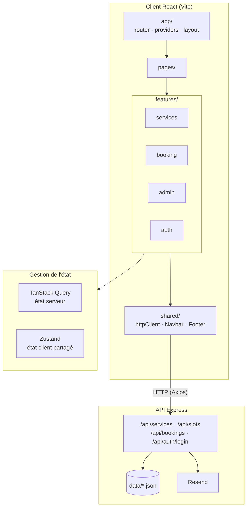

# BookMe

Application web de gestion de rendez-vous développée avec React et TypeScript.

## Fonctionnalités

- Consultation des prestations
- Choix d'une date et d'un créneau
- Validation des formulaires
- Création de réservations
- Gestion des rendez-vous
- Modification du statut
- Email administrateur
- Gestion des erreurs
- Responsive design
- connexion admin

## Stack

### Frontend
- React
- TypeScript
- Vite
- React Router
- TanStack Query
- Zustand
- React Hook Form
- Zod
- Axios

### Backend
- Node.js
- Express
- Resend
- bcrypt 
- JWT

## Architecture

Le projet utilise une architecture orientée features.

```text
src/
├── app/
├── features/
│   ├── booking/
│   ├── services/
│   ├── admin/
│   └── auth/
├── pages/
└── shared/
```

## Schéma d'architecture



## Choix techniques

### Organisation du projet par fonctionnalité

J’ai choisi d’organiser le projet par fonctionnalité. Par exemple, tout ce qui concerne la réservation est regroupé dans le dossier `features/booking`.

L’intérêt, c’est que si je veux modifier, corriger ou supprimer quelque chose lié à la réservation, je sais directement où aller. Je n’ai pas besoin de chercher dans plusieurs dossiers différents.

Avec une organisation classique par type, on aurait par exemple les composants dans un dossier, les hooks dans un autre, les stores ailleurs, puis les schémas encore ailleurs. Une seule fonctionnalité pourrait donc être répartie dans cinq ou six dossiers différents.

L’organisation par fonctionnalité rend donc le projet plus lisible, plus facile à maintenir et permet aussi de mieux voir les dépendances entre les différentes parties de l’application.

### TanStack Query et Zustand

Pour la gestion des données venant de l’API, j’ai utilisé TanStack Query.

Son principal avantage ici est la gestion du cache. Lorsqu’une donnée a déjà été récupérée, TanStack Query peut la conserver temporairement au lieu de refaire systématiquement une nouvelle requête au serveur.

Cela permet d’avoir moins de requêtes inutiles et une navigation plus fluide, notamment lorsqu’on revient sur une page déjà visitée.

Pour l’état global de l’application, notamment certaines informations liées au parcours de réservation, j’ai utilisé Zustand.

Je l’ai choisi parce qu’il est assez simple et lisible. Il ne nécessite pas de `Provider` autour de l’application et le store peut également être testé directement, sans avoir besoin de rendre un composant React.

### Chargement des pages et optimisation

Toutes les pages principales sont chargées avec `React.lazy` et `Suspense` dans le fichier `app/router.tsx`.

Cela permet de faire du *code splitting*. Avec Vite, le code JavaScript est séparé en plusieurs fichiers qui peuvent être chargés uniquement lorsqu’ils sont nécessaires.

Par exemple, une cliente qui vient simplement prendre rendez-vous n’a pas besoin de télécharger le code de toute la partie administration.

De la même manière, au premier affichage de l’accueil, le navigateur charge principalement ce dont cette page a besoin.

L’objectif est donc de réduire ce qui est chargé au démarrage et d’améliorer les performances de l’application.

À cela s’ajoute le cache de TanStack Query, qui évite certaines requêtes répétitives et rend le retour sur des pages déjà consultées beaucoup plus rapide.

### Compromis

Au niveau de la bdd, par faute de temps et parce que c'était plus simple, j'ai opté pour un json au lieu de PostgreSQL et Prisma par exemple. Aussi, le paiement de l'acompte est simulé : pas le temps de mettre en place Stripe.

### Tests

J’ai également mis en place **14 tests répartis dans 5 fichiers**, avec Vitest et React Testing Library.

L’objectif n’était pas seulement de tester des composants individuellement, mais aussi de vérifier les principales règles métier et certains parcours utilisateurs.

| Fichier | Type | Ce qui est testé |
|---|---|---|
| `features/booking/schemas/bookingSchema.test.ts` | Test unitaire métier | Vérifie qu'un email invalide est refusé et qu'une réservation correcte est acceptée |
| `features/booking/store/bookingStore.test.ts` | Test unitaire métier | Vérifie que sélectionner un créneau ne crée pas directement une réservation, que l'identifiant est enregistré après validation et que le parcours peut être réinitialisé |
| `features/booking/components/TimeSlots.test.tsx` | Test de composant | Vérifie que lorsqu'un utilisateur clique sur un créneau, la bonne heure est transmise |
| `pages/CheckoutPage.test.tsx` | Test d'intégration / parcours utilisateur | Vérifie notamment la redirection en cas de sélection manquante, l'absence de requête avant validation, la création de la réservation et la gestion d'un créneau déjà occupé |
| `pages/LoginPage.test.tsx` | Test d'intégration / parcours utilisateur | Vérifie la protection de l'espace administrateur, la validation du formulaire, la connexion et la gestion d'identifiants incorrects |

Dans les tests de parcours utilisateur, j’ai simulé l’API avec `vi.mock`.

L’idée est de tester principalement le comportement de l’interface et la logique du parcours utilisateur sans dépendre du serveur réel.

Donc, même si le backend n’est pas lancé pendant les tests, je peux vérifier que l’application réagit correctement aux différents scénarios prévus.

Lancer :

npm test

---

## Installation

Backend (à faire en premier) :

### Installer les dépendances :

- cd server
- npm install

### Variables d'environnement : copier server/.env.example en server/.env, puis remplir :

- RESEND_API_KEY=...
- ADMIN_EMAIL=...
- JWT_SECRET=...

La clé RESEND_API_KEY est obligatoire, sinon le serveur ne démarre pas. Pour l'obtenir, créer un compte gratuit sur https://resend.com, puis générer une clé dans API Keys (https://resend.com/api-keys).

JWT_SECRET est aussi obligatoire : on peut mettre n'importe quelle longue chaîne de caractères (par exemple une trentaine de lettres et chiffres au hasard).

### Créer un compte admin (toujours dans server) : 

npm run create-admin -- email motdepasse

### Lancer le serveur : npm run dev

Frontend (dans un deuxième terminal) :

- cd client
- npm install
- npm run dev

## Évolutions futures
- Paiement d'acompte avec Stripe
- Synchronisation Google Calendar

---
