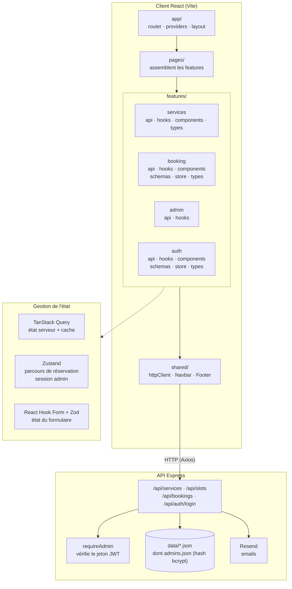
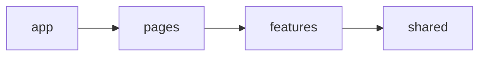
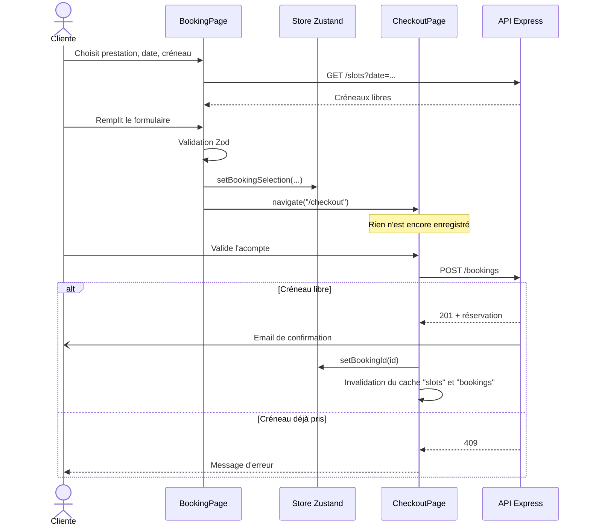
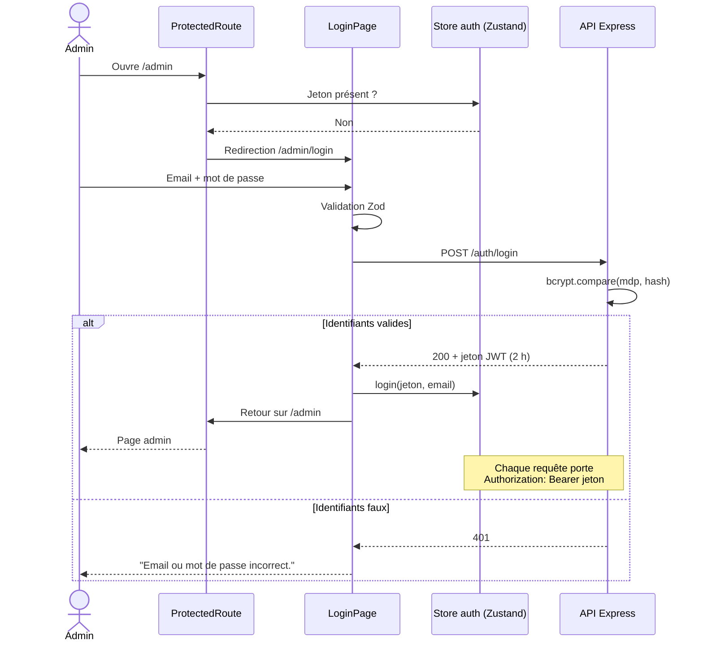

# BookMe

Application web de prise de rendez-vous pour une prothésiste ongulaire (PO), développée avec React et TypeScript.

Une cliente choisit une prestation, une date et un créneau, renseigne ses coordonnées, puis valide un acompte. La réservation est alors enregistrée et un email de confirmation est envoyé. Une page d'administration, accessible après connexion, permet de suivre les rendez-vous et de changer leur statut.

---

## Sommaire

1. [Fonctionnalités](#fonctionnalités)
2. [Stack technique](#stack-technique)
3. [Installation](#installation)
4. [Schéma d'architecture](#schéma-darchitecture)
5. [Choix d'architecture](#choix-darchitecture)
6. [Gestion des données et de l'état](#gestion-des-données-et-de-létat)
7. [Formulaires, erreurs et chargements](#formulaires-erreurs-et-chargements)
8. [Sécurité de l'administration](#sécurité-de-ladministration)
9. [Performance](#performance)
10. [Tests](#tests)
11. [Compromis](#compromis)
12. [Évolutions pour faire grandir l'application](#évolutions-pour-faire-grandir-lapplication)

---

## Fonctionnalités

| Page | Route | Rôle |
|---|---|---|
| Accueil | `/` | Présentation du salon |
| Prestations | `/services` | Liste des prestations (prix, durée, acompte) |
| Réservation | `/booking` | Choix prestation, date, créneau + formulaire client |
| Paiement | `/checkout` | Récapitulatif et validation de l'acompte (crée la réservation) |
| Confirmation | `/confirmation` | Référence et détail du rendez-vous |
| Connexion admin | `/admin/login` | Authentification par email et mot de passe |
| Administration | `/admin` | **Protégée.** Statistiques, liste des rendez-vous, changement de statut |

L'API REST permet de **consulter** (prestations, créneaux libres, réservations) et de **modifier** les données (création d'une réservation, changement de statut).

| Méthode | Route | Accès |
|---|---|---|
| GET | `/api/services` | Public |
| GET | `/api/slots?date=` | Public |
| POST | `/api/bookings` | Public |
| POST | `/api/auth/login` | Public |
| GET | `/api/bookings` | **Admin** (jeton) |
| PATCH | `/api/bookings/:id` | **Admin** (jeton) |

## Stack technique

**Frontend** : React 19, TypeScript, Vite, React Router, TanStack Query, Zustand, React Hook Form, Zod, Axios
**Backend** : Node.js, Express, bcryptjs (hachage des mots de passe), jsonwebtoken (sessions admin), Resend (emails), stockage dans des fichiers JSON
**Tests** : Vitest, React Testing Library, jsdom

## Installation

Prérequis : Node.js 20 ou plus.

### Backend

1. Installer les dépendances :

   ```bash
   cd server
   npm install
   ```

2. Copier `server/.env.example` en `server/.env` et le remplir :

   ```env
   RESEND_API_KEY=re_xxxxxxxx
   ADMIN_EMAIL=adresse@exemple.com
   JWT_SECRET=une-longue-chaine-aleatoire
   # Facultatif : expéditeur sur un domaine vérifié dans Resend
   EMAIL_FROM=BookMe <contact@mondomaine.com>
   ```

   Pour générer un `JWT_SECRET` :

   ```bash
   node -e "console.log(require('crypto').randomBytes(32).toString('hex'))"
   ```

   Le serveur refuse de démarrer sans `JWT_SECRET`.

3. Créer un compte administrateur :

   ```bash
   npm run create-admin -- admin@exemple.com MotDePasseSolide
   ```

   Le compte est enregistré dans `server/data/admins.json` avec le mot de passe **haché** (bcrypt), jamais en clair. Relancer la commande avec le même email change le mot de passe. Ce fichier est exclu de git.

4. Démarrer l'API :

   ```bash
   npm run dev
   ```

   L'API démarre sur `http://localhost:3001/api`.

> Sans `EMAIL_FROM`, l'expéditeur de test `onboarding@resend.dev` est utilisé. Resend n'envoie alors qu'à l'adresse du compte Resend (voir [Compromis](#compromis)).

### Frontend

```bash
cd client
npm install
npm run dev
```

L'URL de l'API peut être changée avec la variable `VITE_API_URL` (par défaut `http://localhost:3001/api`).

### Lancer les tests

```bash
cd client
npm test          # mode watch
npx vitest run    # une seule exécution
```

---

## Schéma d'architecture

### Vue d'ensemble



### Règle de dépendance



Chaque couche n'importe que les couches situées à sa droite. `shared/` ne connaît aucune feature, et les features ne dépendent pas des pages.

### Parcours de réservation



### Authentification de l'administration



---

## Choix d'architecture

### Organisation par features

```text
client/src/
├── app/                 # Point d'entrée : routeur, providers, layout
├── pages/               # Une page par route, assemble les features
├── features/
│   ├── services/        # Catalogue des prestations
│   │   ├── api/         # Appels HTTP
│   │   ├── hooks/       # useServices (TanStack Query)
│   │   ├── components/  # ServiceCard
│   │   └── types/
│   ├── booking/         # Réservation
│   │   ├── api/
│   │   ├── hooks/       # useAvailableSlots, useCreateBooking
│   │   ├── components/  # BookingForm, TimeSlots, BookingSummary
│   │   ├── schemas/     # Validation Zod
│   │   ├── store/       # Store Zustand du parcours
│   │   └── types/
│   ├── admin/           # Gestion des rendez-vous
│   │   ├── api/
│   │   └── hooks/       # useBookings, useUpdateBookingStatus
│   └── auth/            # Connexion de l'administration
│       ├── api/         # login, intercepteurs Axios (jeton, 401)
│       ├── hooks/       # useLogin
│       ├── components/  # LoginForm, ProtectedRoute
│       ├── schemas/     # Validation Zod de la connexion
│       ├── store/       # Session admin (Zustand persisté)
│       └── types/
├── shared/              # Code sans logique métier, réutilisable partout
│   ├── api/             # Instance Axios configurée
│   └── components/      # Navbar, Footer
└── test/                # Configuration des tests
```

**Pourquoi par features et pas par type de fichier** (`components/`, `hooks/`, `services/` globaux) ?
Tout ce qui concerne la réservation se trouve dans `features/booking`. Pour modifier ou supprimer une fonctionnalité, on travaille dans un seul dossier. Dans une organisation par type, une même fonctionnalité serait dispersée dans 5 ou 6 dossiers, et le couplage entre fonctionnalités deviendrait invisible.

**Séparation des responsabilités à l'intérieur d'une feature** :

| Couche | Responsabilité | Exemple |
|---|---|---|
| `api/` | Appel HTTP, rien d'autre | `createBooking(payload)` |
| `hooks/` | Branchement sur TanStack Query : cache, invalidation | `useCreateBooking()` |
| `schemas/` | Règles de validation métier | `bookingSchema` |
| `store/` | État partagé entre pages | `useBookingStore` |
| `components/` | Affichage, reçoit ses données par props | `TimeSlots` |
| `pages/` | Assemble les briques et gère la navigation | `CheckoutPage` |

Les composants comme `TimeSlots` ou `BookingForm` ne font aucun appel réseau. Ils sont donc réutilisables et faciles à tester.

**Pourquoi `pages/` en dehors des features ?**
Une page peut combiner plusieurs features : `BookingPage` utilise `services` (liste des prestations) et `booking` (créneaux, formulaire). La placer dans une feature créerait une dépendance d'une feature vers une autre.

**Pourquoi un client HTTP unique dans `shared/api` ?**
L'URL de base et les en-têtes sont définis à un seul endroit. L'authentification l'a confirmé : pour ajouter le jeton à toutes les requêtes, la feature `auth` enregistre deux intercepteurs sur ce client (`features/auth/api/authInterceptors.ts`), branchés une seule fois dans `main.tsx`. `shared/` n'a pas été modifié et ne connaît toujours pas l'authentification, et aucun appel API des autres features n'a changé.

### Ajouter une fonctionnalité

L'architecture permet d'ajouter une fonctionnalité sans modifier l'existant. Par exemple, pour des avis clients :

1. Créer `features/reviews/` avec ses dossiers `api/`, `hooks/` et `components/`.
2. Créer `pages/ReviewsPage.tsx`.
3. Ajouter une route lazy dans `app/router.tsx`.

Aucun fichier des features `booking`, `services` ou `admin` n'est modifié.

C'est ce qui s'est passé pour l'authentification : la feature `auth` a été ajoutée en créant son dossier, une page `LoginPage` et une route. Côté existant, seuls le routeur (`/admin` placée sous `ProtectedRoute`) et la page admin (bouton de déconnexion) ont changé.

---

## Gestion des données et de l'état

Chaque type d'état a un outil adapté, et on n'utilise d'état global que lorsque c'est nécessaire.

| Type d'état | Outil | Exemples | Pourquoi |
|---|---|---|---|
| **Serveur** | TanStack Query | prestations, créneaux, réservations | Données qui appartiennent au serveur : cache, rechargement, états de chargement et d'erreur, invalidation après une modification |
| **Parcours client** | Zustand | sélection et coordonnées entre `/booking`, `/checkout` et `/confirmation` | Doit survivre à un changement de page |
| **Session admin** | Zustand + `persist` (localStorage) | jeton JWT, email de l'admin | Lu par la route protégée et par l'intercepteur Axios, doit survivre à un rechargement |
| **Formulaire** | React Hook Form + Zod | champs, erreurs de validation | Local au formulaire, sans re-render à chaque frappe |
| **Interface** | `useState` | date et créneau sélectionnés sur la page | Ne concerne qu'un composant |

**Pourquoi Zustand pour le parcours plutôt que Context ou Redux Toolkit ?**
- Avec un **Context**, tous les composants qui le consomment se re-rendent à chaque changement. Zustand permet de s'abonner à une seule valeur (`useBookingStore((s) => s.setBookingSelection)`).
- **Redux Toolkit** est surdimensionné pour un seul store de 10 champs. Toutes les données serveur sont déjà gérées par TanStack Query.
- Zustand est lisible, sans provider, et le store se teste sans rendre de composant.

**Pourquoi pas de données serveur dans Zustand ?**
Recopier les réservations dans un store global créerait deux sources de vérité à synchroniser à la main. TanStack Query reste l'unique source pour tout ce qui vient de l'API.

**Pourquoi la réservation n'est créée qu'à la validation de l'acompte ?**
Si la réservation était créée dès le formulaire, une cliente qui abandonne au paiement bloquerait quand même le créneau. Le formulaire garde donc la sélection dans Zustand, et le `POST /bookings` part uniquement au clic sur « Valider l'acompte ». Le serveur revérifie alors la disponibilité et renvoie une erreur 409 si le créneau a été pris entre-temps.

---

## Formulaires, erreurs et chargements

- **Validation** : un schéma Zod (`bookingSchema`) est branché sur React Hook Form avec `zodResolver`. Le type TypeScript du formulaire est déduit du schéma (`z.infer`), donc les règles et les types ne peuvent pas diverger.
- **Chargement** : chaque page qui lit des données affiche un état de chargement (`isLoading`). Les boutons de mutation sont désactivés pendant l'envoi (`isPending`) et changent de libellé (« Validation en cours... »).
- **Erreurs** : message et bouton « Réessayer » (`refetch`) sur les prestations et l'admin ; message explicite si le créneau n'est plus disponible au paiement.
- **Protection du parcours** : `/checkout` redirige vers `/booking` si aucune sélection n'est en cours.

---

## Sécurité de l'administration

**Côté serveur**, c'est là que se trouve la vraie protection :
- **Comptes en base** : les admins sont dans `data/admins.json`, créés uniquement par la commande `npm run create-admin`. Il n'y a pas de route d'inscription, donc personne ne peut se créer un compte depuis le site.
- **Mot de passe haché avec bcrypt** (10 tours) : seul le hash est stocké. Un hash ne se déchiffre pas. À la connexion, `bcrypt.compare` hache le mot de passe saisi et compare les deux. Même en lisant le fichier, on ne retrouve pas le mot de passe.
- **Jeton JWT signé** avec `JWT_SECRET`, valable 2 h. Le middleware `requireAdmin` le vérifie sur `GET /api/bookings` et `PATCH /api/bookings/:id` : sans jeton valide, l'API répond 401. La liste des clientes (noms, emails, téléphones) n'est donc plus lisible par n'importe qui.
- **Message d'erreur unique** (« Email ou mot de passe incorrect ») : on ne révèle pas si un email correspond à un compte.

**Côté client**, c'est du confort d'utilisation, pas de la sécurité :
- `ProtectedRoute` redirige vers `/admin/login` sans session, puis ramène sur la page demandée après connexion.
- Un intercepteur Axios ajoute `Authorization: Bearer <jeton>` à chaque requête. Si le serveur répond 401 (jeton expiré), la session est effacée et l'admin est renvoyé à la connexion.
- À la déconnexion, les réservations sont retirées du cache TanStack Query.

---

## Performance

### 1. Chargement différé des pages (code splitting)

Toutes les pages sont chargées avec `React.lazy` et `Suspense` dans `app/router.tsx`. Vite génère un fichier JavaScript par page.

**Pourquoi** : une cliente qui réserve ne télécharge jamais le code de la page d'administration, et le premier affichage de l'accueil ne charge que ce dont il a besoin.

**Mesure** (`npm run build`) :

| Fichier | Taille | Chargé quand |
|---|---|---|
| `index.js` (React, routeur, TanStack Query) | 332 kB (104 kB gzip) | Toujours |
| `BookingPage.js` (inclut React Hook Form + Zod) | 123 kB (37 kB gzip) | Seulement sur `/booking` |
| `AdminPage.js` | 3,6 kB | Seulement sur `/admin`, après connexion |
| `LoginPage.js` | 2,5 kB | Seulement sur `/admin/login` |
| `HomePage.js` | 2,8 kB | Seulement sur `/` |

Les librairies de formulaire, les plus lourdes après React, ne sont téléchargées que par les visiteurs qui ouvrent la page de réservation.

### 2. Cache TanStack Query

- `staleTime` de 60 s par défaut (`app/providers.tsx`), et de 5 min pour les prestations (`useServices`), qui changent rarement.
- Revenir sur `/services` ou changer de date puis revenir n'entraîne pas de nouvel appel réseau tant que les données sont fraîches.
- Les créneaux sont mis en cache **par date** (`["slots", date]`).

**Pourquoi** : moins de requêtes, navigation instantanée entre les pages déjà visitées.

**Cohérence du cache** : après une réservation, `useCreateBooking` invalide les clés `slots` et `bookings`. Après un changement de statut, `useUpdateBookingStatus` invalide `bookings`. Le cache ne peut donc pas afficher comme libre un créneau qui vient d'être réservé.

### 3. Limitation des re-renders

- React Hook Form utilise des champs non contrôlés : taper dans un champ ne re-rend pas tout le formulaire.
- `BookingPage` s'abonne uniquement à l'action `setBookingSelection` du store Zustand (sélecteur) : remplir le parcours ne la re-rend pas. `CheckoutPage` et `ConfirmationPage` lisent tout le store, ce qui est voulu puisqu'elles affichent l'ensemble du récapitulatif.

---

## Tests

14 tests dans 5 fichiers, lancés avec Vitest et React Testing Library.

| Fichier | Type | Ce qui est vérifié |
|---|---|---|
| `features/booking/schemas/bookingSchema.test.ts` | Unitaire, **métier** | Refus d'un email invalide, acceptation d'une réservation valide |
| `features/booking/store/bookingStore.test.ts` | Unitaire, **métier** | La sélection ne crée pas de réservation, l'identifiant est enregistré après validation, la réinitialisation vide le parcours |
| `features/booking/components/TimeSlots.test.tsx` | **Composant** | Le clic sur un créneau appelle `onSelectTime` avec la bonne heure |
| `pages/CheckoutPage.test.tsx` | Intégration, **parcours utilisateur** | Redirection sans sélection ; aucune requête avant validation ; création de la réservation puis redirection vers la confirmation ; message d'erreur si le créneau est pris |
| `pages/LoginPage.test.tsx` | Intégration, **parcours utilisateur** | `/admin` inaccessible sans session ; accès avec session ; validation du formulaire avant tout appel API ; connexion puis ouverture du tableau de bord ; message d'erreur si les identifiants sont faux |

Dans les tests de parcours, l'API est simulée (`vi.mock`) : on teste le comportement de l'interface sans dépendre du serveur.

---

## Compromis

Ces choix sont volontaires pour le périmètre du projet. En production, il faudrait les revoir.

| Compromis | Raison | Limite |
|---|---|---|
| Stockage dans des fichiers JSON | Aucune base à installer, projet lançable en deux commandes | Pas de transactions : deux réservations simultanées sur le même créneau pourraient passer |
| Paiement de l'acompte simulé | Hors du périmètre front-end évalué | Aucun encaissement réel |
| Jeton admin stocké dans `localStorage` | Simple à mettre en place, la session survit à un rechargement | Lisible par du JavaScript injecté (faille XSS). Un cookie `httpOnly` serait plus sûr |
| Pas de limite de tentatives de connexion | Hors périmètre | Un attaquant peut essayer des mots de passe en boucle (force brute) |
| Jeton de 2 h sans renouvellement | Pas de mécanisme de refresh token à gérer | L'admin est déconnecté au bout de 2 h, même s'il est actif |
| Emails via l'expéditeur de test Resend | Pas de nom de domaine pour ce projet | Les emails ne partent que vers l'adresse du compte Resend |
| Créneaux horaires fixes côté serveur | Suffisant pour démontrer le parcours | Ne tient pas compte de la durée des prestations ni des jours de fermeture |
| Parcours stocké en mémoire (Zustand) | Simple et rapide | Un rechargement de `/checkout` renvoie à `/booking` |

> En développement, `nodemon` est configuré pour ignorer `server/data/` : sinon chaque écriture dans `bookings.json` relancerait le serveur et couperait la requête en cours (et l'envoi des emails).

## Évolutions pour faire grandir l'application

**Données et backend**
- Remplacer les fichiers JSON par une base de données (PostgreSQL + Prisma), avec une contrainte d'unicité sur (date, heure) pour garantir l'absence de double réservation.
- Calculer les créneaux selon la durée de chaque prestation et les horaires d'ouverture.

**Fonctionnalités**
- Paiement réel de l'acompte avec Stripe Checkout, la réservation passant à `CONFIRMED` à la réception du webhook.
- Renforcer l'authentification : jeton dans un cookie `httpOnly`, refresh token, limitation des tentatives (`express-rate-limit`), réinitialisation du mot de passe par email.
- Plusieurs rôles (gérante, employée) avec des droits différents.
- Vérification d'un domaine dans Resend pour écrire à toutes les clientes.
- Synchronisation avec Google Calendar.

**Qualité et architecture**
- Persister le parcours de réservation (`persist` de Zustand dans `sessionStorage`) pour résister à un rechargement.
- Valider les données côté serveur avec le même schéma Zod, placé dans un package partagé.
- Générer les types de l'API (OpenAPI) pour éviter les écarts entre front et back.
- Tests de bout en bout avec Playwright et intégration continue (GitHub Actions) qui lance lint, typage et tests.
- Pagination et filtres sur la page d'administration quand le nombre de rendez-vous augmente.
